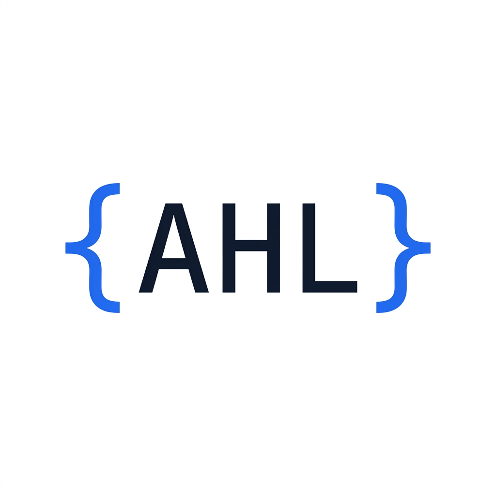

# Decide Once: My Identity Kit

**Track:** General AI Fluency  
**Role:** Backend AI Engineer  

---

## 1. Typography
*Choosing two fonts that contrast but complement each other.*

- **Heading Font:** Inter 
  - *Why:* Geometric, highly legible, modern. It gives a structured and clean look to titles.
- **Body & Code Font:** JetBrains Mono
  - *Why:* A monospace font designed for developers. Using it for body text alongside Inter creates an immediate "technical documentation" vibe, signaling to the recruiter that this portfolio belongs to an engineer.

## 2. Palette
*A tight palette (4 colors) with actual hex codes. Kept highly neutral so the code/work is the loudest thing on the page.*

- **Background (Near-White):** #F8FAFC *(Slate 50)* - Softer on the eyes than pure white.
- **Primary Text (Near-Black):** #0F172A *(Slate 900)* - High contrast but less harsh than #000000.
- **Secondary Text (Muted):** #64748B *(Slate 500)* - Used for less critical information (timestamps, captions).
- **The Single Accent:** #2563EB *(Blue 600)* - A sharp "Electric Blue" used exclusively for links, primary buttons, and CTA elements.

## 3. Logo / Monogram
A clean, minimal code-snippet monogram reflecting the backend developer identity.

## 4. The Style Note
*This is the standing instruction I add to my Claude Project to ensure consistency in generated HTML/CSS or markdown:*

> **Style Note:** Use Inter for stark headings and JetBrains Mono for body text to evoke a clean, technical atmosphere. The palette is high-contrast Slate (#F8FAFC bg, #0F172A text) with a single Electric Blue (#2563EB) accent to ensure the engineering work remains the focal point of the page.
