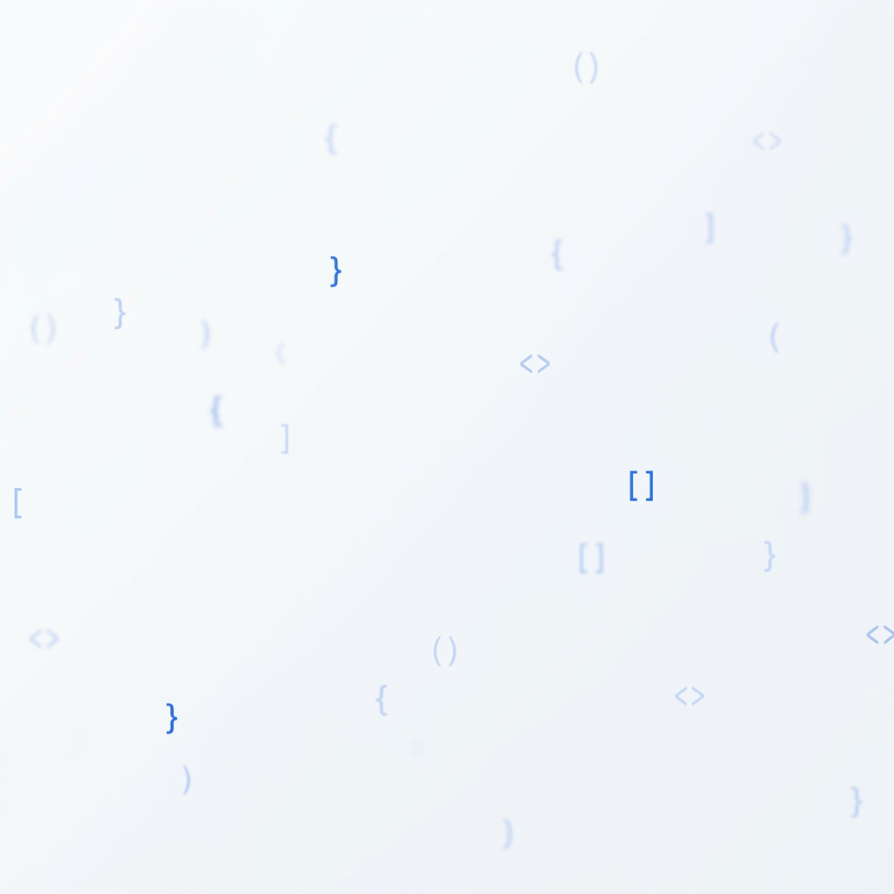
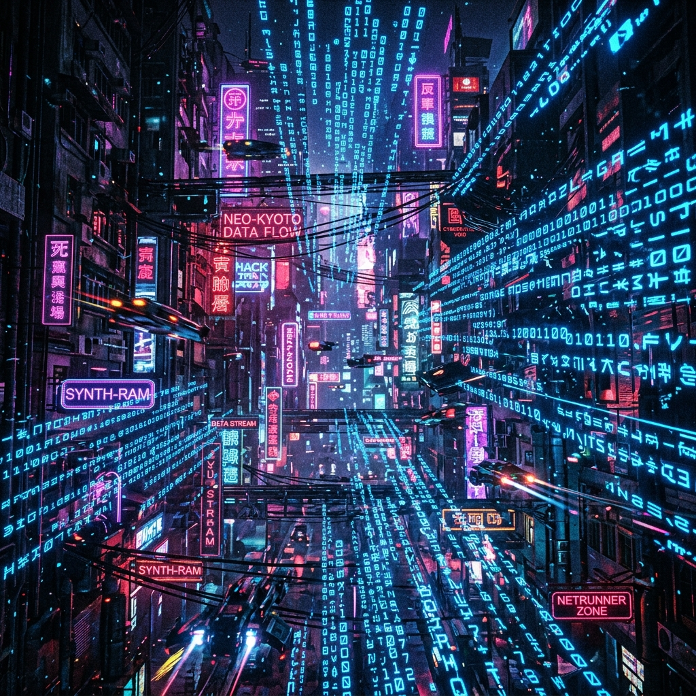

# Kill your darlings: Curate Your Images

**Track:** General AI Fluency  

---

## 1. The Image List (Content Map)
My backend portfolio needs the following visual assets:
- **Hero Image / Connective Tissue:** An abstract background texture that sets the technical mood without distracting from the content.
- **The Work (Real Captures):** Screenshots of the actual backend architecture, Swagger UI, and database schemas.
- **The Creator (Real Photo):** A professional headshot of myself.

## 2. The Keepers (Real Captures & Accepted Generations)

### The Work: Real Captures
For my work, I strictly used **Real Captures** (screenshots generated from my actual running code and database). AI was not used to fake my work. 

- **Database Evidence:** ../assets/db_screenshot_1786566180170.jpg (Proves the PostgreSQL integration is real).
- **API Evidence:** ../assets/swagger_screenshot_1786554952333.jpg (Proves the FastAPI endpoints exist).
- **Auth Evidence:** ../assets/swagger_auth_screenshot_1786567598585.jpg (Proves Supabase JWT integration).

### The Connective Tissue: Accepted Hero Texture
For the design layer, I iterated an AI prompt to match my Identity Kit (Slate background, Electric Blue accents).

*Why I kept it:* It is pristine, ample with whitespace, and uses a very subtle code-bracket motif. It establishes a modern engineering mood but remains extremely quiet so that my text and real screenshots will stand out.

### The Creator: Real Photo
*(Placeholder)* [headshot.jpg] - I am using an actual, well-lit photograph of myself for the bio section. Using an AI avatar here would instantly destroy trust with a recruiter.

---

## 3. The Rejection Note (Discernment)

### The Rejected Image

**Why I rejected it:**
While this "cyberpunk hacker" image looks cool and impressive on its own, it completely violates my Identity Kit. It is far too noisy, cluttered, and dark. If I used this as a background, any text placed over it would be illegible, and it would aggressively compete with the screenshots of my actual work. It screams "amateur who just discovered AI generators" rather than "senior engineer who understands clean design." I killed this darling because it served the ego, not the portfolio.
