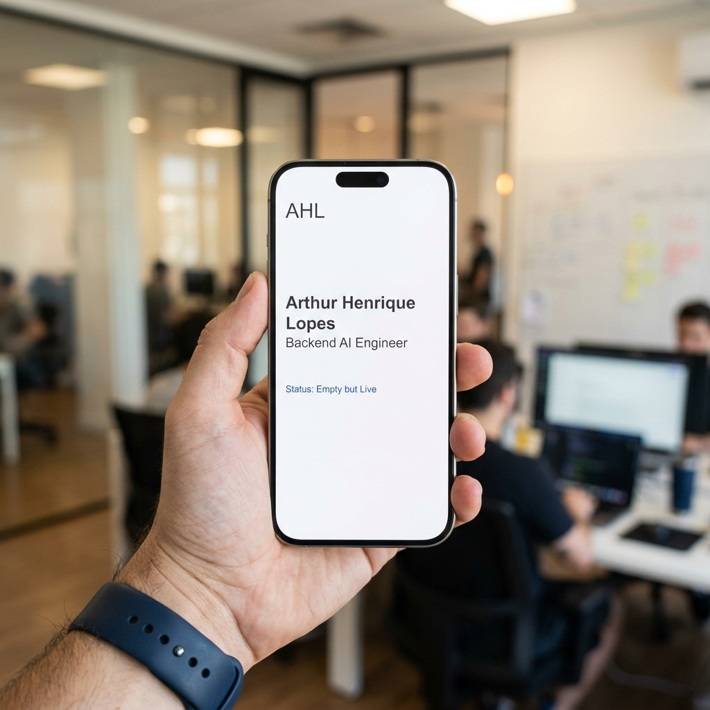

# Empty but Live: Ship a Blank Page

**Track:** General AI Fluency  

---

## 1. The Milestone
The hardest step in building a portfolio is going from a local folder to a live URL. I decided to use **GitHub Pages** because it integrates perfectly with my existing astapi-todo monorepo. It hosts static files directly from the repository, requiring zero external server configuration.

## 2. The Setup
I created a simple docs/index.html file using the exact style tokens from my Identity Kit (Inter for headings, JetBrains Mono for body, #F8FAFC background, and the Electric Blue #2563EB accent).

The page simply reads my name and "Status: Empty but Live". 

## 3. The Live URL
The project is officially deployed and live on the internet! 

**Live Link:** [https://arthurhenriquelopes.github.io/fastapi-todo/](https://arthurhenriquelopes.github.io/fastapi-todo/)

## 4. Verification & Screenshots
I opened the URL on my smartphone to verify that it resolves correctly on a separate network and device, proving it is truly live and not just a local cache.

---

*Note: All Identity Kit variables, Case Studies, and Content Maps have been successfully integrated into this repository so they are ready for the final build phase.*
