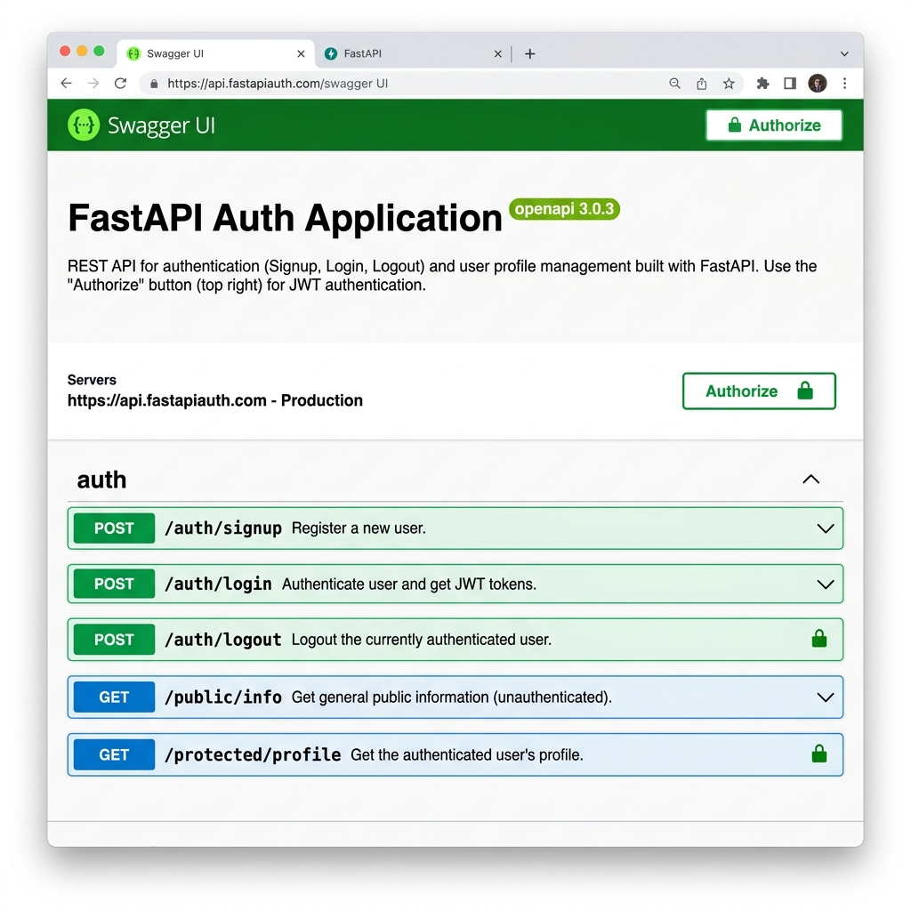

# FastAPI To-Do List & Auth API

This project contains two major components:
1. **To-Do CRUD API:** A task management API backed by a PostgreSQL database running in Docker.
2. **Authentication API:** A secure authentication system using Supabase as the Identity Provider (IdP) providing JWTs for protected routes.

Built as part of the Backend Track Assignments (A1 to A4).

## How to Install & Run

1. Ensure you have [Docker](https://docs.docker.com/get-docker/) installed.
2. Create your `.env` file from the `.env.example` file and insert your Supabase credentials:
```bash
cp .env.example .env
# Edit .env and put your SUPABASE_URL and SUPABASE_KEY
```
3. Run the following command to start the database and the API:
```bash
docker compose up -d
```
The API will be available at `http://localhost:8000`.

## API Endpoints

### 🔐 Authentication Routes

| HTTP Method | Endpoint | Auth Required? | Description |
| ----------- | -------- | -------------- | ----------- |
| POST        | `/auth/signup` | No | Register a new user |
| POST        | `/auth/login` | No | Log in and receive a JWT Access Token |
| POST        | `/auth/logout` | Yes 🔒 | Invalidate the current session |
| GET         | `/public/info` | No | Open route for anyone |
| GET         | `/protected/profile` | Yes 🔒 | Secure route requiring Bearer Token |

### 📝 Task CRUD Routes

| HTTP Method | Endpoint | Description |
| ----------- | -------- | ----------- |
| GET         | `/tasks` | Lists all tasks |
| GET         | `/tasks/{id}` | Gets a specific task by ID |
| POST        | `/tasks` | Creates a new task |
| PUT         | `/tasks/{id}` | Updates an existing task |
| DELETE      | `/tasks/{id}` | Removes a task by ID |

## Swagger UI Screenshot

