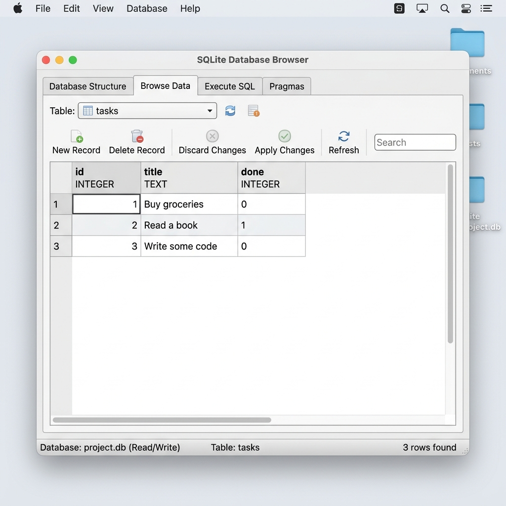
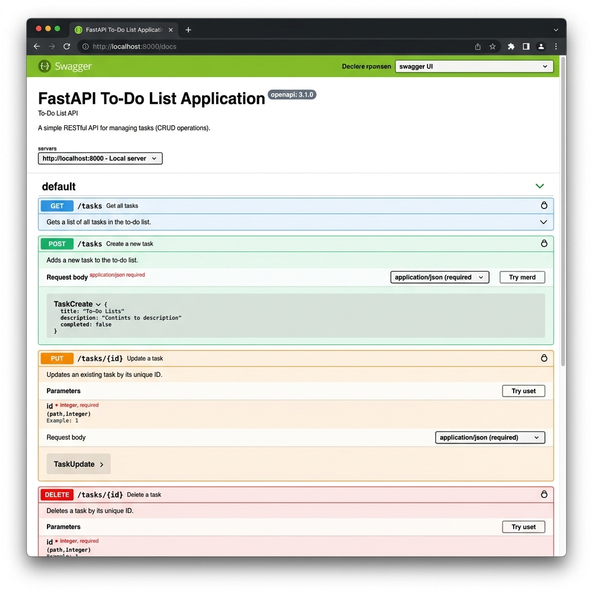

# FastAPI To-Do List CRUD (SQLite Version)

This is a small API that manages a to-do list: you can **create** tasks, **read** them, **update** them, and **delete** them.
The data is stored in a permanent SQLite database (`tasks.db`).

Built as part of the Backend Track - Week 3 Assignment (A2).

## Why SQLite?
SQLite is a lightweight, zero-configuration SQL database that stores all data in a single file (`tasks.db`). It's perfect for small projects because it requires no separate database server to run, yet it provides full SQL capabilities, ensuring our data persists between server restarts.

## How to Install & Run

Ensure you have Python 3.10+ installed. Then run the following command in the project directory:

```bash
pip install -r requirements.txt && uvicorn main:app --reload --port 8000
```
Upon running, the API will automatically create the `tasks.db` file and populate it with 3 sample tasks if it's empty.

## Endpoints

| HTTP Method | Endpoint | Description |
| ----------- | -------- | ----------- |
| GET         | `/` | Root endpoint, describes the API |
| GET         | `/health` | Health check to see if server is alive |
| GET         | `/tasks` | Lists all tasks |
| GET         | `/tasks/{id}` | Gets a specific task by ID |
| POST        | `/tasks` | Creates a new task (requires JSON body with `title`) |
| PUT         | `/tasks/{id}` | Updates an existing task's `title` or `done` status |
| DELETE      | `/tasks/{id}` | Removes a task by ID |

## Example `curl` Output

```bash
$ curl -i http://localhost:8000/tasks/1
HTTP/1.1 200 OK
date: Wed, 12 Aug 2026 17:00:00 GMT
server: uvicorn
content-length: 49
content-type: application/json

{"title":"Buy groceries","done":false,"id":1}
```

## Example SQL Query Executed
```sql
SELECT * FROM tasks WHERE done = 1;
```

## Database Screenshot


## Swagger UI Screenshot

